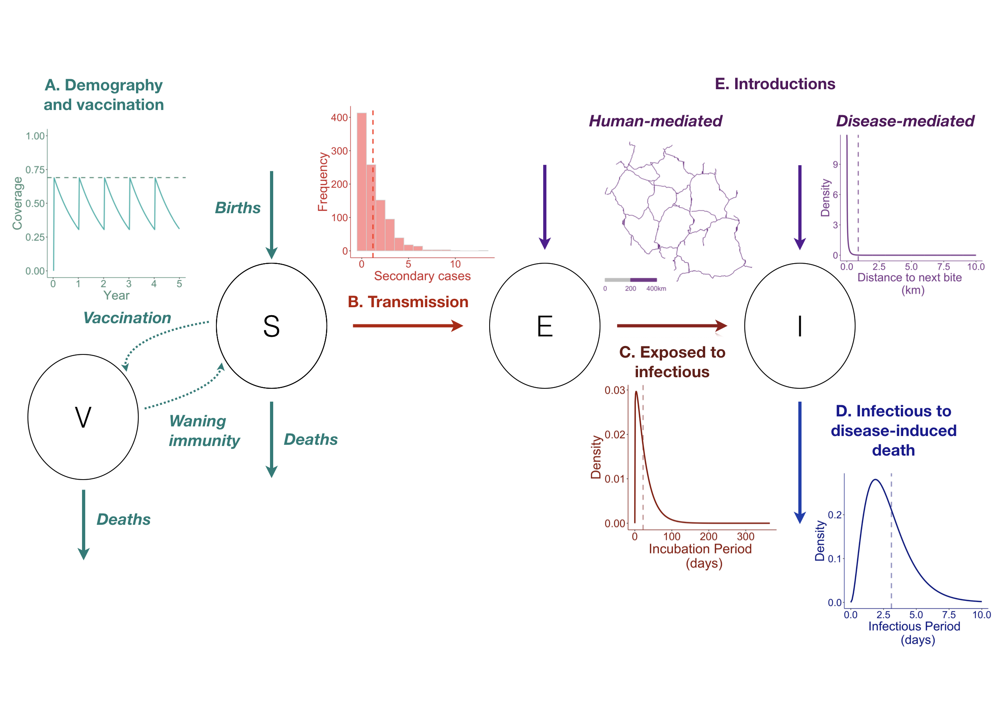

# Modeling canine rabies virus transmission dynamics 
### Chapter 20 in [Rabies, 4th edition](https://www.elsevier.com/books/rabies/fooks/978-0-12-818705-0). 
### Full text (author's pre-editorial version) available [here](https://oar.princeton.edu/jspui/handle/88435/pr1mf4h).
### See figures, tables, and code [here](https://mrajeev08.github.io/ModelingChapter/).  

  

  
## Abstract

Mathematical models of infectious disease are used to develop an understanding of disease dynamics and aid in the design of control strategies. Specifically, modeling can guide planning and implementation of interventions and improve our understanding of how disease dynamics, and therefore intervention strategies, may change as control measures are implemented. In light of the mounting evidence that elimination of canine rabies is a realistic objective, the WHO has set a global target of zero human deaths due to dog-mediated rabies by 2030. In this chapter, we focus on how dynamic epidemiological modeling can contribute to guiding efforts to achieve this goal. We review existing modeling work and the insights generated from these studies, and identify outstanding questions and gaps in our knowledge. We further discuss the role that modeling can play in the future to address these questions and inform elimination.

## In this repository

The following supplemental files referred to in the main text of the Chapter are included here and in the html output:
- [Table S1](tables/supptable_S1.xlsx): excel file with summary of all modeling studies included in the
literature review.
- [Figure S1](figs/figS1.jpeg): density vs. frequency dependent transmission models
- [Figure S2](figs/figS2.jpeg): types of modeling studies reviewed

Final figures are in [figs/](figs) and tables in [tables/](tables). Data pulled from modeling studies and used to make figures are included in [data/](data), and this folder also includes the raw Scopus and Pubmed results used for the literature review, as well as the shapefile of Tanzania Roads from [the World Bank](https://datacatalog.worldbank.org/dataset/tanzania-roads) used in Figure 1E. 

All main/supplemental figures and tables can be viewed along with code [here](https://mrajeev08.github.io/ModelingChapter/).
  
Full pre-editorial version is available through the [Princeton University Open Access Repository](https://oar.princeton.edu/jspui/handle/88435/pr1mf4h) (no login required!).

