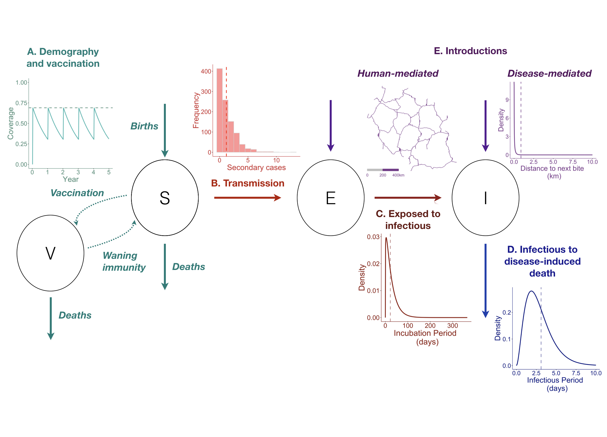
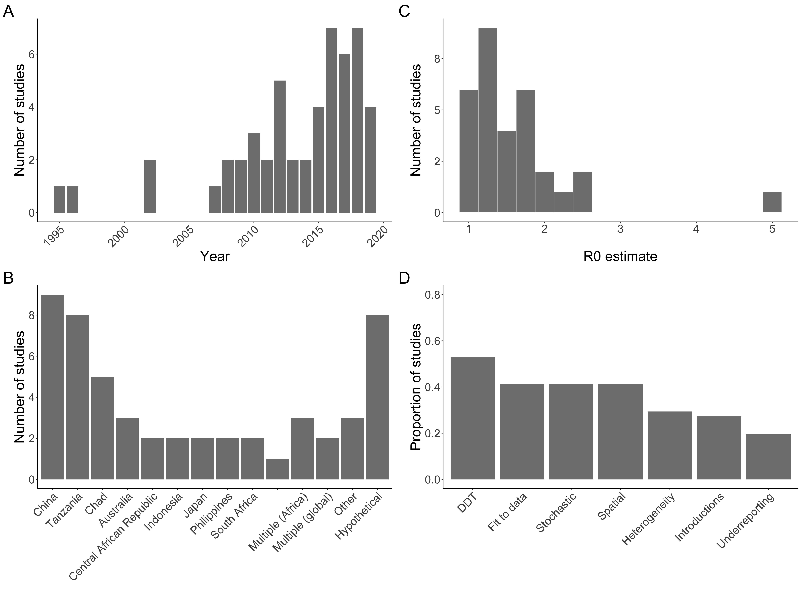
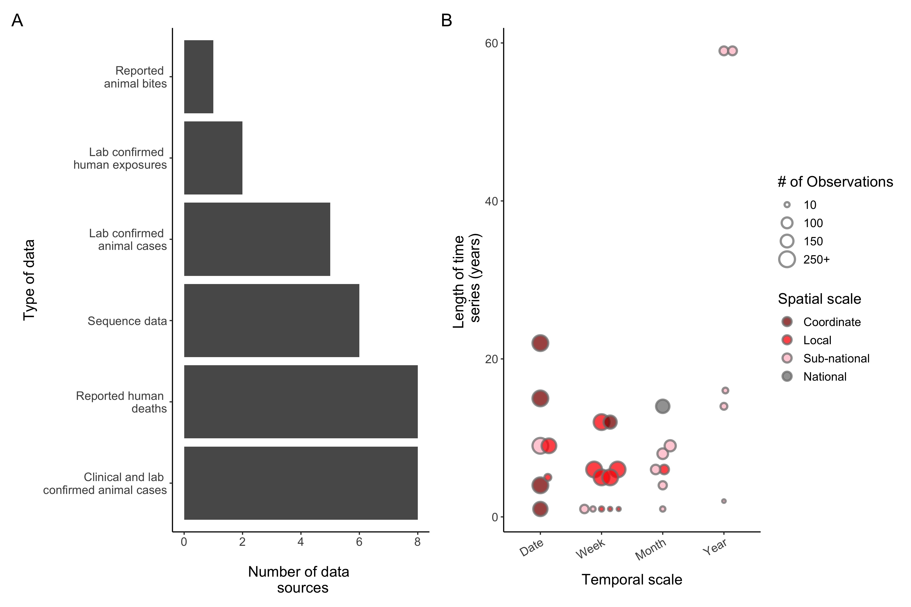
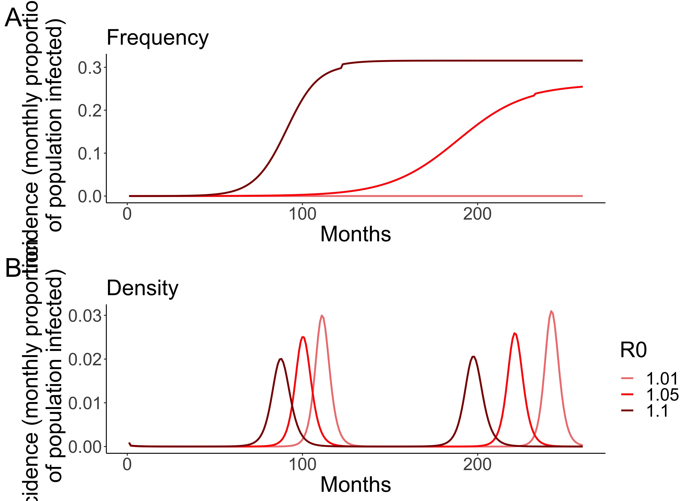
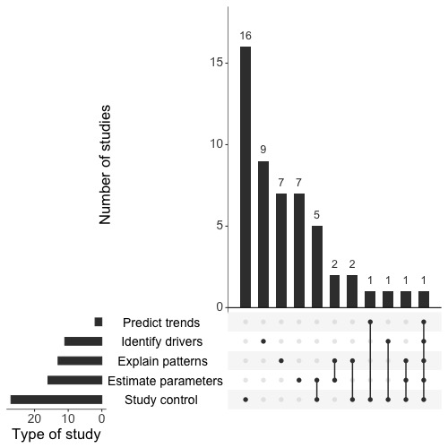

---
output:
  html_document:
    code_folding: hide
    css: github.css
    includes:
      before_body: header.html
bibliography: ["references.bib"]
---
<meta name="viewport" content="width=device-width, initial-scale=1">
<link rel="stylesheet" href="github.css">
<style>
	.markdown-body {
		box-sizing: border-box;
		min-width: 200px;
		max-width: 980px;
		margin: 0 auto;
		padding: 45px;
	}

	@media (max-width: 767px) {
		.markdown-body {
			padding: 15px;
		}
	}
</style>

<article class="markdown-body">

```{r setup, include=FALSE}
rm(list = ls())
library(knitr)
library(kableExtra)
knitr::opts_chunk$set(echo = TRUE, message = FALSE, error = FALSE, 
                      warning = FALSE, fig.fullwidth = TRUE)
library(ggplot2)
library(deSolve)
library(rgdal)
library(ggthemes)
library(ggsn)
library(tidyverse)
library(patchwork)
library(UpSetR)
library(DT)
library(readxl)
source("render_toc.R")

newtheme <- theme_classic() + theme(text = element_text(size = 14), panel.background = element_blank())

```

# Modeling canine rabies virus transmission dynamics
<font size="4"> _**Chapter 20 in forthcoming Rabies, 4th edition**_</font>  
<font size="4"> _**Figures, tables, supplementary materials, and code**_</font>  
  
_*`r Sys.Date()`*_

## Authors
<font size="4"> Malavika Rajeev, C. Jessica E. Metcalf </font>  
*Department of Ecology and Evolutionary Biology*   
*Princeton University,*  
*Princeton, New Jersey, USA*  
  
  
<font size="4"> Katie Hampson </font>  
*Institute of Biodiversity, Animal Health and Comparative Medicine*  
*College of Medicine, Veterinary Medicine and Life Sciences*  
*University of Glasgow*  
*Glasgow G12 8QQ, UK*  

## Contents
```{r toc, echo=FALSE}
render_toc("figures_code.Rmd", toc_header_name = "Contents", 
           excludes = c("Authors", "Modeling canine rabies virus transmission dynamics", 
                        "Figures, tables, and associated code for chapter in forthcoming Rabies, 4th edition", "r Sys.Date()"),
           toc_depth = 1)
```

## Abstract

Mathematical models of infectious disease are used to develop an understanding of disease dynamics and aid in the design of control strategies. Specifically, modeling can guide planning and implementation of interventions and improve our understanding of how disease dynamics, and therefore intervention strategies, may change as control measures are implemented. In light of the mounting evidence that elimination of canine rabies is a realistic objective, the WHO has set a global target of zero human deaths due to dog-mediated rabies by 2030. In this chapter, we focus on how dynamic epidemiological modeling can contribute to guiding efforts to achieve this goal. We review existing modeling work and the insights generated from these studies, and identify outstanding questions and gaps in our knowledge. We further discuss the role that modeling can play in the future to address these questions and inform elimination.  

 
## Figure 20.1: SEIV framework for modeling rabies {#fig1}

```{r figure 1, results = 'hide'}
## Project population
vacc_reconstruct <- function(t, y, parms){
  dS <- -parms["deaths"] * y["S"] + parms["births"] * (y["S"] + y["V"]) + parms["waning"] * y["V"]
  dV <- -parms["deaths"] * y["V"] - parms["waning"] * y["V"]
  dWaning <- -parms["waning"] * y["V"]
  dDeaths <- -parms["deaths"] * y["V"]
  dBirths <- -parms["births"] * (y["S"] + y["V"])
  return(list(c(dS, dV)))
} 

eventfun <- function(t, y, parms){
  with (as.list(y),{
    diff <- 0.7*(S + V) - V ## newly vaccinated
    V <- V + diff
    S <- S - diff
    return(c(S, V))
  })
}


## times in relevant timestep
times <- seq (1/52, 5, by = 1/52) ## weekly for 10 years

## initial pop
IS <- 70000
IV <- 0

## param
births <- 0.50
deaths <- 0.42
waning <- 0.33
parms <- c(deaths = deaths, births = births, waning = waning)

## run
calcsus <- lsoda(y = c(S = IS, V = IV), times = times, func = vacc_reconstruct, parms = parms, 
                 events = list(func = eventfun, time = seq(1/52, 5, by = 1)))
vacc_df <- data.frame(Year = calcsus[, "time"], propVacc = calcsus[,"V"]/(calcsus[,"V"] + calcsus[,"S"]))
vacc_a <- ggplot(data = vacc_df, aes(x = Year, y = propVacc)) +
  geom_line(color = "lightseagreen", size = 1) +
  xlab ("Year") +
  ylab("Coverage") + 
  ylim(c(0, 1)) +
  geom_hline(yintercept = 0.69, color = "aquamarine4", linetype = 2, size = 1) +
  newtheme +
  theme(text = element_text(color = "aquamarine4"), axis.text = element_text(color = "aquamarine4"), 
        axis.line = element_line(color = "aquamarine4"))
ggsave("../figs/fig1/vacc_a.jpeg", vacc_a, device = "jpeg", width = 5, height = 5)

### Secondary cases
## params
set.seed(123)
secondaries <- data.frame(secondaries = rnbinom(1000, mu = 1.2, size = 1.3))
sec_b <- ggplot(data = secondaries, aes(x = secondaries)) +
  geom_histogram(binwidth = 1, color = "lightgray", fill = "red", alpha = 0.5) +
  geom_vline(xintercept = 1.2, color = "red", linetype = 2, size = 1.1) +
  xlab("Secondary cases") +
  ylab("Frequency") +
  newtheme +
  theme(text = element_text(color = alpha("firebrick3", 1)),
        axis.text = element_text(color = alpha("firebrick3", 1)), 
        axis.line = element_line(color = alpha("firebrick3", 1)))
ggsave("../figs/fig1/sec_b.jpeg", sec_b, device = "jpeg", width = 5, height = 5)
# include_graphics("figs/fig1/secc_b.jpeg")

### Incubation period
incubation <- as.data.frame(list(Days = seq(0, 365, 1), 
                           Density = dgamma(seq(0, 365, 1), shape = 1.1518, 
                                    rate = 0.0429)))
inc_c <- ggplot(data = incubation, aes (x = Days, y = Density)) +
  geom_line(color = "darkred", size = 1.2) +
  xlab("Incubation Period \n (days)") +
  geom_vline(xintercept = 22.3, color = "darkred", linetype = 2, size = 1.1, alpha = 0.5) +
  newtheme +
  theme(text = element_text(color = "darkred"), axis.text = element_text(color = "darkred"), 
        axis.line = element_line(color = "darkred"))
ggsave("../figs/fig1/inc_c.jpeg", inc_c, device = "jpeg", width = 5, height = 5)

### Infectious period
infectious <- as.data.frame(list(Days = seq(0, 10, 0.1), 
                           Density = dgamma(seq(0, 10, 0.1), shape = 2.9012, 
                                    rate = 1.013)))
inf_d <- ggplot(data = infectious, aes (x = Days, y = Density)) +
  geom_line(color = "navy", size = 1.2) +
  xlab("Infectious Period \n (days)") +
  geom_vline(xintercept = 3.1, color = "navy", linetype = 2, size = 1.2, alpha = 0.5) +
  newtheme +
  theme(text = element_text(color = "navy"), axis.text = element_text(color = "navy"), 
        axis.line = element_line(color = "navy"))
ggsave("../figs/fig1/inf_d.jpeg", inf_d, device = "jpeg", width = 5, height = 5)


### Road network with scale
tz_roads <- readOGR("../data/Tanzania_Roads/Tanzania_Roads.shp")
tz_roads <- fortify(tz_roads)

map_e1 <- ggplot(data = tz_roads, aes(x = long, y = lat, group = group)) +
  geom_line(color = "mediumorchid4") +
  scalebar(tz_roads, location = "bottomleft", 
           dist = 200, dist_unit = "km", transform = TRUE, box.fill = c("mediumorchid4", "grey"),
           box.color =  c("mediumorchid4", "grey"),
           st.size = 5, st.dist = 0.05, st.color = "mediumorchid4", 
           height = 0.02, model = 'WGS84') +
  theme_map()

ggsave("../figs/fig1/map_e1.jpeg", map_e1, device = "jpeg", width = 5, height = 5)


### Dispersal kernel
## params
dispersal <- as.data.frame(list(km = seq(0, 10, 0.01), 
                           Density = dgamma(seq(0, 10, 0.01), shape = 0.215, 
                                    scale = 0.245)))
disp_e2 <- ggplot(data = dispersal, aes (x = km, y = Density)) +
  geom_line(color = "mediumorchid4", size = 1.2) +
  xlab("Distance to next bite \n (km)") +
  geom_vline(xintercept = 0.88, color = "mediumorchid4", linetype = 2, size = 1.2, alpha = 0.75) +
  newtheme +
  theme(text = element_text(color = "mediumorchid4"), axis.text = element_text(color = "mediumorchid4"), 
        axis.line = element_line(color = "mediumorchid4"))

ggsave("../figs/fig1/disp_e2.jpeg", disp_e2, device = "jpeg", width = 5, height = 5)

```

```{r fig1 final, echo = FALSE}
## Final figure 1 (assembled in keynote!)

```
  
**Figure 20.1.** The **S**usceptible-**E**xposed-**I**nfectious-**V**accinated **(SEIV)** modeling framework for canine rabies: circles indicate epidemiological classes, arrows linking circles indicate how individuals can move between classes, insets describe underlying processes and influences.  **A)** Host demography (i.e., the balance between births and deaths) and vaccination govern the susceptible and vaccinated population dynamics. Following vaccination campaigns, vaccination coverage (y axis, inset) first increases (vertical jumps) then wanes over time (x axis) as vaccinated individuals die, susceptible individuals are born, or as immunity conferred by vaccination wanes (in this example, campaigns reach 70% of the population annually, but coverage wanes to approximately 35% before the next annual campaign). **B)** Transmission is on average low, but highly heterogeneous. Inset shows number of secondary cases generated from a negative binomial distribution (n = 1000 draws, mean number of secondary cases = 1.2, red dashed line). **C)** Individuals move from exposed to infectious on average after 22.3 days (inset, dashed line) but this is also highly variable with some infections occurring months to years after exposure. **D)** Disease-induced mortality is complete, and the infectious period is short, on average 3.1 days (dashed line), with deaths due to infection occurring within 10 days. **E)** Introductions from outside the population modeled may seed cases within. Introductions may results from disease-mediated movement of infectious dogs (sometimes upwards of 10 km; inset shows dispersal kernel, gamma distribution) and human-mediated movements of incubating dogs (potentially on the scale of 100s of km through movement along roads; the inset shows an example of a major road network in Tanzania). All parameters used and associated references are listed in Table 20.1  
  
  
## Table 20.1: Key parameter values associated with underlying processes illustrated in Figure 20.1 {#table1}

```{r}
table1 <- read.csv("../tables/maintable_20.1.csv")
kable(table1, rownames = FALSE) %>%
  kable_styling(bootstrap_options = c("striped", "hover")) %>%
  collapse_rows()
```
  
   
## Figure 20.2: Summarizing studies {#fig2}

```{r figure 2}
studies <- read.csv("../data/modeling_studies.csv")

## A. Studies by Year
year_A <- ggplot(data = studies, aes(x = Year)) +
  geom_bar(fill = "grey50") +
  scale_y_continuous(labels = scales::number_format(accuracy = 1)) +
  ylab("Number of studies") +
  labs(tag = "A") +
  newtheme +
  theme(axis.text.x = element_text(angle = 45, hjust = 1))

## B. Studies by country
## refactor countries first
studies %>%
  mutate(Country = fct_recode(Country, Other = "India", Other = "Israel", Other = "Kenya")) -> studies
## then plot   
country_B <- ggplot(data = studies, aes(x = fct_relevel(reorder(Country, Country, function(x)-length(x)), 
                                            "Multiple (Africa)", "Multiple (global)", 
                                           "Other", "Hypothetical", after = 10))) + 
  geom_bar(fill = "grey50") +
  scale_y_continuous(breaks = seq(0, 10, by = 2), labels = scales::number_format(accuracy = 1)) +
  ylab("Number of studies") +
  xlab("") +
  labs(tag = "B") +
  newtheme +
  theme(axis.text.x = element_text(angle = 45, hjust = 1))

## C. R0 plot
r_ests <- read.csv("../data/r_ests.csv")
R0_C <- ggplot(data = filter(r_ests, R_type == "R0"), aes(x = Estimate)) +
  geom_histogram(binwidth = 0.25, color = "white", fill = "grey50") +
  scale_y_continuous(labels = scales::number_format(accuracy = 1)) +
  labs(tag = "C") +
  xlab("R0 estimate") +
  ylab("Number of studies") +
  newtheme

## D. Key modeling decisions and features
studies %>%
  select(14:20) %>%
  gather() %>%
  filter(value %in% "Y") %>%
  group_by(key) %>%
  summarize(proportion = n()/51) -> summary
features_D <- ggplot(data = summary, aes(x = reorder(key, -proportion), y = proportion)) +
  geom_col(fill = "grey50") +
  scale_x_discrete(labels = c("DDT", 
                              "Fit to data", "Stochastic", "Spatial", 
                              "Heterogeneity", "Introductions", 
                              "Underreporting")) +
  ylab("Proportion of studies") +
  ylim(c(0, 0.8)) +
  xlab("") +
  labs(tag = "D") +
  newtheme +
  theme(axis.text.x = element_text(angle = 45, hjust = 1))


fig2 <- year_A + R0_C + country_B + features_D + plot_layout(ncol = 2, nrow = 2)
ggsave("../figs/fig2.jpeg", fig2, device = "jpeg", width = 8, height = 8)


```
  
**Figure 20.2. Summary of studies with a dynamic model of canine rabies.** A total of 51 studies were included. **A)** Year of publication, with most studies published after 2006; **B)** Countries where rabies dynamics were modeled: studies were concentrated in China, Tanzania, and Chad, but many also examined dynamics in hypothetical contexts, not specific to any geographic situation. **C)** Estimates of R0: most studies estimated R0 below 2 (10 studies, with 31 estimates; estimates of Re (the effective reproduction number which accounts for ongoing vaccination) and Rt (time-varying reproductive number) were excluded (N = 3). **D)** Key features of models (N = 51): most assumed density-dependent transmission (N = 27). Less than half were fit to data (N = 20), stochastic (N = 20), or spatially-explicit (N = 19). 15/51 studies incorporated individual heterogeneity in transmission and 14/51 introductions from outside the population modeled. Only 10 included an observation model in their analysis or accounted for underreporting in their inference. Full bibliography and metadata included in Supplementary Table 1.)
  
   
## Figure 20.3: summary of data used in modeling studies {#fig3}

```{r Fig 3}
## Reported data
repdata <- read.csv("../data/reported_data.csv")
repdata %>%
  mutate(Nobs_maxed = case_when(Nobs < 250 ~ as.numeric(Nobs), Nobs >= 250 ~ 250), 
         Spatial.scale = fct_relevel(Spatial.scale, "National", after = Inf), 
         Temporal.scale = fct_relevel(Temporal.scale, "Month", after = 2)) -> repdata

data_A <- ggplot(data = repdata, aes(x = reorder(Type.of.data, Type.of.data,function(x)-length(x)))) + 
  geom_bar() +
  newtheme +
  scale_x_discrete(labels = c("Clinical and lab \n confirmed animal cases", 
                              "Reported human \n deaths", 
                              "Sequence data", "Lab confirmed \n animal cases", 
                              "Lab confirmed \n human exposures", "Reported \n animal bites")) +
  xlab("Type of data") +
  ylab("Number of data \n sources") +
  labs(tag = "A") +
  coord_flip()

data_B <- ggplot(data = repdata, aes(x = Temporal.scale, y = Length, fill = Spatial.scale, size = Nobs_maxed)) +
  ggbeeswarm::geom_beeswarm(cex = 3.5, alpha = 0.75, shape = 21, color = "grey50", stroke = 1.5) +
  scale_fill_manual(values = c("Darkred", "Red", "Pink", "Grey50"), name = "Spatial scale") +
  scale_size_area(name = "# of Observations", breaks = c(10, 100, 150, 250), 
                       labels = c("10", "100", "150", "250+")) +
  ylab("Length of time \n series (years)") +
  xlab("Temporal scale") +
  newtheme +
  labs(tag = "B") +
  theme(axis.text.x = element_text(angle = 30, hjust = 1)) +
  guides(fill = guide_legend(override.aes = list(size = 3)))
fig3 <- data_A + data_B + plot_layout(ncol = 2, widths = c(1, 1))
ggsave("../figs/fig3.jpeg", plot = fig3, device = "jpeg", height = 8, width = 12)

```
  
**Figure 20.3. Rabies data reported in modeling studies** (N = 25 studies reporting 30 unique data sources). **A)** Type of data used. **B)** The scales of temporal (x-axis) and spatial (colors) information available and the duration (y axis). The size of the points is proportional to the number of observations in each data set. Any rabies data that was reported in studies were included (even if not used for fitting purposes, only for qualitative comparison). If multiple data sets were used, they were included as separate data sources, and if the same data set was used in multiple studies it was only included once.
  
   
## Supplementary Figure S1: comparing models {#figS1}

```{r SEI mods}
# models
SEI.rabies <- function(nu = 0.50, mu = 0.42, R0 = 1.2, sigma = (1/22.3*365),
                       gamma = (1/3.1*365), K = 20, START.S = 50000, 
                       START.E = 0, START.I = 2,
                       START.S.density = 15, START.I.density = 0.01, 
                       START.E.density = 0.00, years = 20, steps = 1/52, model = "frequency",...){
  
  ### Deterministic skeleton of models for rabies
  
  require(deSolve)
  
  times <- seq(from = 0, to = years, by = steps)
  
  ## Simple FDT model with complete disease-induced mortality
  if (model == "frequency"){
    
    START.N <- START.S + START.E + START.I
    
    beta = (R0*gamma*(sigma + mu))/sigma
      
      # This function models a time step for the SIR:
      dx.dt.SIR <- function(t, y, parms) {
        N <- y["S"] + y["E"] + y["I"] 
        S <- y["S"]
        E <- y["E"]
        I <- y["I"]
        
        # Calculate the change in Susceptible
        dS <-  parms["nu"]*(S + E) - parms["mu"]*S - parms["beta"]*S*I/N
        
        #Calculate the change in Exposed
        dE <- parms["beta"]*S*I/N - parms["mu"]*E - parms["sigma"]*E
        
        # Calculate the change in Infected
        dI <- parms["sigma"]*E - parms["gamma"]*I
        
        # Return a list with the changes in S, E, I, R at the current time step
        return(list(c(dS, dE, dI)))
      }
      
      # Create the parameter vector
      parms <- c(nu = nu, mu = mu, beta = beta, sigma = sigma, gamma = gamma)
      inits <- c(S = START.S, E = START.E, I = START.I)
  }
  
  ## Classical fox rabies model (widely used for dog rabies as well, adapted from Anderson et al. 1981)
  if (model == "density"){
    
    START.N.density <- START.S.density + START.I.density + START.E.density
    
    # the old school rabies model
    # This function models a time step for the SIR:
    dx.dt.SIR <- function(t, y, parms) {
      N <- y["S"] + y["I"] + y["E"]
      S <- y["S"]
      E <- y["E"]
      I <- y["I"]

      ## Calculate dmort and beta here from parms and plug them in
      dmort <- (parms["nu"] - parms["mu"])/parms["K"]
      beta <- (parms["R0"]*(parms["sigma"] + parms["nu"])*(parms["gamma"] + parms ["nu"]))/(parms["sigma"]*parms["K"])
      
      # Calculate the change in Susceptible
      dS <-  parms["nu"]*N - parms["mu"]*S - dmort*S - beta*S*I
      
      #Calculate the change in Exposed
      dE <- beta*S*I - parms["mu"]*E - dmort*N*E - parms["sigma"]*E
      
      # Calculate the change in Infected
      dI <- parms["sigma"]*E - parms["mu"]*I - dmort*N*I - parms["gamma"]*I
      
      # Return a list with the changes in S, E, I, R at the current time step
      return(list(c(dS, dE, dI)))
    }
    
    # Create the parameter vector
    parms <- c(nu = nu, mu = mu, R0 = R0, K = K, sigma = sigma, gamma = gamma)
    inits <- c(S = START.S.density, E = START.E.density, I = START.I.density)
  }
  
  # Run the ODE solver
  SIR.output <- lsoda(y = inits, 
                      times = times, 
                      func = dx.dt.SIR, 
                      parms = parms)
  SIR.output <- as.data.frame(SIR.output)
  SIR.output$N <- SIR.output$S + SIR.output$E + SIR.output$I
  return (SIR.output)
}

## Density dependent
ddt_1.01 <- SEI.rabies(R0 = 1.01, years = 20, model = "density")
ddt_1.01 <- data.frame(infected = unname(tapply(ddt_1.01$I, (seq_along(ddt_1.01$I)-1) %/% 4, sum)[1:260]),
                       pop = ddt_1.01$N[seq(1, 20*52, 4)], R0 = 1.01, trans = "Density")
ddt_1.1 <- SEI.rabies(R0 = 1.1, years = 20, model = "density")
ddt_1.1 <- data.frame(infected = unname(tapply(ddt_1.1$I, (seq_along(ddt_1.1$I)-1) %/% 4, sum)[1:260]),
                       pop = ddt_1.1$N[seq(1, 20*52, 4)], R0 = 1.1, trans = "Density")
ddt_1.05 <- SEI.rabies(R0 = 1.05, years = 20, model = "density")
ddt_1.05 <- data.frame(infected = unname(tapply(ddt_1.05$I, (seq_along(ddt_1.05$I)-1) %/% 4, sum)[1:260]),
                      pop = ddt_1.05$N[seq(1, 20*52, 4)], R0 = 1.05, trans = "Density")

ddt <- bind_rows(ddt_1.01, ddt_1.1, ddt_1.05)
ddt$time <- 1:260

ddt_plot <- ggplot(data = ddt, aes(x = time, y = infected/pop, group = R0, color = as.factor(R0))) + 
  geom_line(size = 1) +
  scale_color_manual(values = c("lightcoral", "red", "darkred"), name = "R0") +
  xlab("Months") +
  ylab("Incidence (monthly proportion \n of population infected)") +
  newtheme +
  labs(tag = "B", subtitle = "Density")

## Frequency dependent
fdt_1.01 <- SEI.rabies(R0 = 1.01, years = 20, model = "frequency")
fdt_1.01 <- data.frame(infected = unname(tapply(fdt_1.01$I, (seq_along(fdt_1.01$I)-1) %/% 4, sum)[1:260]),
                       pop = fdt_1.01$N[seq(1, 20*52, 4)], R0 = 1.01, trans = "Frequency")
fdt_1.1 <- SEI.rabies(R0 = 1.1, years = 20, model = "frequency")
fdt_1.1 <- data.frame(infected = unname(tapply(fdt_1.1$I, (seq_along(fdt_1.1$I)-1) %/% 4, sum)[1:260]),
                      pop = fdt_1.1$N[seq(1, 20*52, 4)], R0 = 1.1, trans = "Frequency")
fdt_1.05 <- SEI.rabies(R0 = 1.05, years = 20, model = "frequency")
fdt_1.05 <- data.frame(infected = unname(tapply(fdt_1.05$I, (seq_along(fdt_1.05$I)-1) %/% 4, sum)[1:260]),
                       pop = fdt_1.05$N[seq(1, 20*52, 4)], R0 = 1.05, trans = "Frequency")
fdt <- bind_rows(fdt_1.01, fdt_1.1, fdt_1.05)
fdt$time <- 1:260

fdt_plot <- ggplot(data = fdt, aes(x = time, y = infected/pop, group = R0, color = as.factor(R0))) + 
  geom_line(size = 1) +
  scale_color_manual(values = c("lightcoral", "red", "darkred"), name = "R0") +
  xlab("Months") +
  ylab("Incidence (monthly proportion \n of population infected)") +
  guides(colour = "none") +
  newtheme +
  labs(tag = "A", subtitle = "Frequency")
figS1 <- fdt_plot / ddt_plot
ggsave("../figs/figS1.jpeg", plot = figS1, device = "jpeg", height = 7, width = 7)

```
  
**Density vs. frequency-dependent transmission.** Monthly incidence (the proportion of the population infected, and thus removed (as a result of mortality)) from mass-action models of rabies with **A)** frequency and B) density dependent transmission. Even in low transmission scenarios (R0 = 1.01 - 1.1), incidence peaks at between 1.5 – 2.0% per month for models with density-dependent transmission and between 0.01 - 30% for frequency-dependent transmission, compared with the 1 - 2% max annual incidence observed empirically. Demographic and transmission parameters are listed in Table 20.1 (mean incubation and infectious periods were input as annual rates). Frequency-dependent model is a SEI model with starting dog population of 50,000 and seeded with 2 infectious individuals. Density-dependent model is adapted from Anderson et al. 1981, with starting population density of 15 dogs per km2 , 0.01 infectious dogs per km2, and carrying capacity of 29 dogs per km2. 
  
   
## Supplementary Figure S2: types of studies {#figS2}

```{r extra upset plots, results = 'hide'}
## Study category
studies %>%
  mutate_at(vars(starts_with("Category")), 
            function(x) ifelse(x == "N" | is.na(x), 0, 1)) %>%
  select(Reference, starts_with("Category")) -> categories
names(categories)
names(categories) <- c("Reference", "Explain patterns",
                       "Estimate parameters", "Study control",
                       "Identify drivers", "Predict trends")

## Upset plot
jpeg("../figs/figS2.jpeg", width = 1500, height = 1500)
upset(categories, nsets = 5, nintersects = NA,
      sets.x.label = "Type of study", mainbar.y.label = "Number of studies", text.scale = 5)
dev.off()

## Bar plot
studies %>%
  select(Reference, starts_with("Category")) %>%
  gather() %>%
  filter(value %in% "Y") -> cat_summary
table(cat_summary$key)
```

```{r supp fig 2, echo = FALSE}

```

**Types of modeling studies (categories adapted from @lloyd-smithEpidemicDynamicsHumanAnimal2009)**. 1) Predict future trends based on currently available data and model projections; 2) Study control measures (using models to estimate/simulate the impacts of control efforts and compare intervention strategies); 3) Estimate key parameters such as Ro, the incubation period, the dispersal kernel; we also differentiate between studies which 4) Identify drivers of dynamics (that is look at hypothetical factors which may drive transmission without comparing or fitting to data) and studies which 5) Explain observed patterns (use models and data to determine likely drivers of observed patterns).
  
   
## Supplementary Table 1: Modeling studies included in literature review {#supptables .tabset}

### Table S1 {#tableS1}
```{r}
Table_S1 <- read_excel("../tables/supptable_S1.xlsx")
Table_S1 %>%
  dplyr::select(-Citation, -`Cite Key`) %>%
  datatable(rownames = FALSE)
```

### Key for columns {#colkey}
```{r}
cols_S1 <- read_excel("../tables/supptable_S1.xlsx", sheet = "DefineColumns")
kable(cols_S1, rownames = FALSE) %>%
  kable_styling(bootstrap_options = c("striped", "hover")) %>%
  collapse_rows()
```

### Key for values in columns {#valkey}
```{r}
cols_S1 <- read_excel("../tables/supptable_S1.xlsx", sheet = "DefineTerms")
kable(cols_S1, rownames = FALSE) %>%
  kable_styling(bootstrap_options = c("striped", "hover"))
```

### Citations {#citations}
```{r}
library(DT)
library(readxl)
Table_S1 <- read_excel("../tables/supptable_S1.xlsx")
Table_S1 %>%
  dplyr::select(`Cite Key`, Citation) %>%
  kable(rownames = FALSE) %>%
  kable_styling(bootstrap_options = c("striped", "hover")) %>%
  scroll_box(height = "1000px")
```
   
## Session info {#session}
```{r print session info}
sessionInfo()
```
  
   
## References {#refs}
<div id="refs"></div>

</article>
